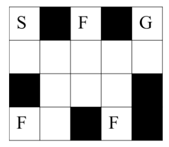
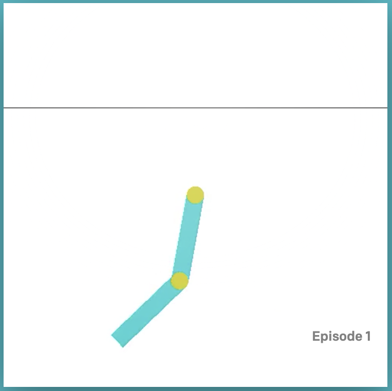
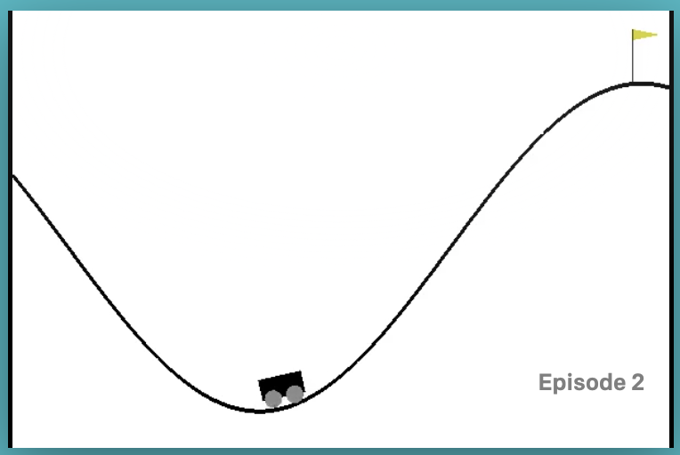

# Reinforcemnent Learning

Using various Reinforcement Learning algorithms to solve 3 problems: 

1) Maze Navigation: 

How to get from S to G in the Maze, and collect the most number of flags F along the way. There are 4 actions the robot can take: going UP, DOWN, LEFT, RIGHT.

.

2) Open AI Acrobot: 

How to swing the bot’s arm to reach a certain height.

3) Open AI Mountain Car: 

How to push & pull the car to make it reach the mountain’s top.

## How to run

Run these commands in your Terminal:

### 1. Maze Navigation problem:

#### 1.1 Value iteration algorithm:

    python value_iteration.py

#### 1.2 Q-learning algorithm: 

    python qlearning_maze.py

### 2. Open AI Acrobot problem:

#### 2.1 Deep reinforcement learning - REINFORCE algorithm with Neural network:

    python reinforce_bot.py

#### 2.2 Q-learning algorithm:

    python qlearning_gym.py bot

### 3. Open AI Mountain Car problem:

#### 3.1 Deep reinforcement learning - REINFORCE algorithm with Neural network:

    python reinforce_car.py

#### 3.2 Q-learning algorithm:

    python qlearning_gym.py car
